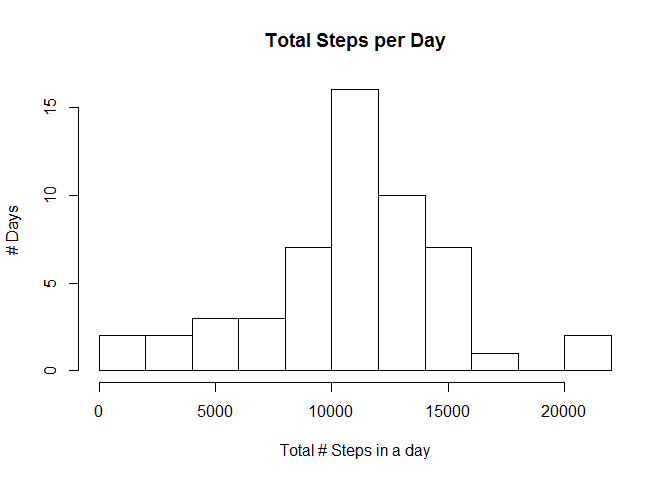

# Reproducible Research: Peer Assessment 1


## Loading and preprocessing the data

The first step is to unzip the 'activity.zip' file:

```r
unzip("activity.zip")
```

This will unzip the contents of the zip file to the current directory. The zip contains a single file called 'activity.csv'

The next step is to read the data into memory:

```r
data <- read.csv("activity.csv")
head(data)
```

```
##   steps       date interval
## 1    NA 2012-10-01        0
## 2    NA 2012-10-01        5
## 3    NA 2012-10-01       10
## 4    NA 2012-10-01       15
## 5    NA 2012-10-01       20
## 6    NA 2012-10-01       25
```

Some of the data is unavailable and we initially would like to ignore this data. So we make a clean data set called 'avail', excluding the missing values:

```r
avail <- data[!is.na(data$steps),]
head(avail)
```

```
##     steps       date interval
## 289     0 2012-10-02        0
## 290     0 2012-10-02        5
## 291     0 2012-10-02       10
## 292     0 2012-10-02       15
## 293     0 2012-10-02       20
## 294     0 2012-10-02       25
```

## What is mean total number of steps taken per day?

To calculate this we must group the data by day and aggregate the number of steps. To do this we will use the plyr library:

```r
library(plyr)
```

Next we use the ddply function to group the data by date, and to create a histogram to see the rough distribution of the data:

```r
daily_totals <- ddply(avail, .(date), summarize, total_steps = sum(steps))
hist(daily_totals$total_steps, xlab = "Total # Steps in a day", ylab="# Days", main = "Total Steps per Day", breaks = 10)
```

<!-- -->

And using the data in daily_totals we can calculate the mean and median number of steps per day:

```r
mean <- mean(daily_totals$total_steps)
median <- median(daily_totals$total_steps)
```


```
## [1] "Mean: 10766.1886792453"
```

```
## [1] "Median: 10765"
```


## What is the average daily activity pattern?

Next we want to look at the activity pattern during the day, so we instead group by time interval instead of date, and summarize using the mean.


```r
daily_pattern <- ddply(avail, .(interval), summarize, mean_steps = mean(steps))
plot(daily_pattern, interval~mean_steps, type="l")
```

<!-- -->

From the chart we can see that most steps are taken in the morning, if we restrict the chart we can get a better view of the morning period:

```r
plot(daily_pattern, interval~mean_steps, type="l", xlim=c(500,1000))
```

<!-- -->

From this we can see that the most active period starts around 8am, and finishes just after 9am.

We can use the which.max function to calculate exactly which period has the most steps on average:

```r
max_steps <- daily_pattern[which.max(daily_pattern$mean_steps),]
print(paste("Max  Steps:", round(max_steps$mean_steps,0), ", Interval:", max_steps$interval))
```

```
## [1] "Max  Steps: 206 , Interval: 835"
```

Which shows us that the on average 206 steps are taken around 8.35am, which is the most active 5 minute interval.

## Imputing missing values

We removed NA's from the dataset earlier, we would like to now include them back.

First we count the number of NA's in the original dataset:

```r
nas <- length(which(is.na(data$steps)))
print(paste("NA's: ", nas))
```

```
## [1] "NA's:  2304"
```

Next we will join the original data source with our daily_pattern on interval, and create a column imp_steps, which will contain the number of steps if available, or the average steps for that interval if not:

```r
imputed <- merge(data, daily_pattern, by.x = c("interval"), by.y=c("interval"))
imputed$imp_steps <- ifelse(is.na(imputed$steps), imputed$mean_steps, imputed$steps)
# Print the number of NA's in the dataset to verify we have none
nas <- length(which(is.na(imputed$imp_steps)))
print(paste("NA's: ", nas))
```

```
## [1] "NA's:  0"
```

Finally we compare the histograms total step counts for each data set to see the difference:

```r
# Plot a histogram of daily totals for the imputed data
imp_daily_totals <- ddply(imputed, .(date), summarize, total_steps = sum(imp_steps))
hist(imp_daily_totals$total_steps, xlab = "Total # Steps in a day", ylab="# Days", main = "Total Steps per Day", breaks = 10, col=rgb(1,0,0,0.5))

# Overlay the original data with NAs stripped out
hist(daily_totals$total_steps, xlab = "Total # Steps in a day", ylab="# Days", main = "Total Steps per Day", breaks = 10, col=rgb(0,0,1,0.5), add=T)
```

<!-- -->

## Are there differences in activity patterns between weekdays and weekends?

To answer this question we must separate the imputed data into a data set for the weekdays and one for weekends. So the first step is to add a factor variable to the data set, and then to extract a weekend and a weekday data set:


```r
imputed$weekday <- factor(weekdays(as.Date(imputed$date)))
weekend <- imputed[imputed$weekday == "Saturday" | imputed$weekday == "Sunday",]
weekday <- imputed[imputed$weekday != "Saturday" & imputed$weekday != "Sunday",]
```

Next we get the average number of steps per day for each data set and plot them to see if there are any differences in the pattern:

```r
imp_weekday_totals <- ddply(weekday, .(interval), summarize, mean_steps = mean(imp_steps))
imp_weekend_totals <- ddply(weekend, .(interval), summarize, mean_steps = mean(imp_steps))
par(mfrow=c(2,1)) 
plot(imp_weekday_totals, interval~imp_steps, type="l", main="Weekdays", xlab="")
plot(imp_weekend_totals, interval~imp_steps, type="l", main="Weekends", xlab="Time of Day")
```

<!-- -->

As we can see for the data, the number of steps is more concentrated un the morning on weekdays than on weekends.
